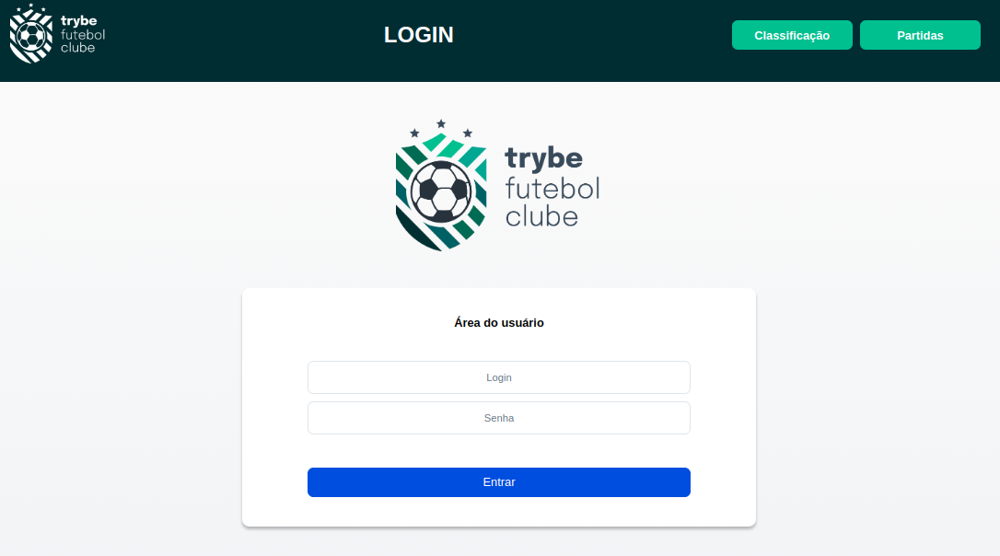
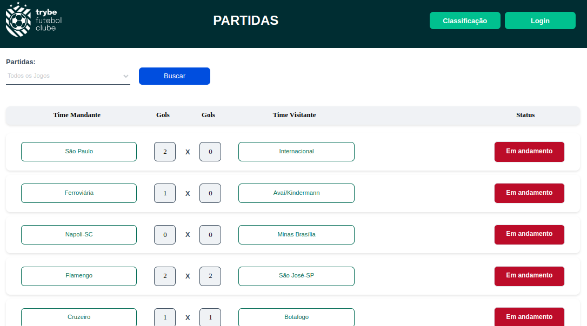
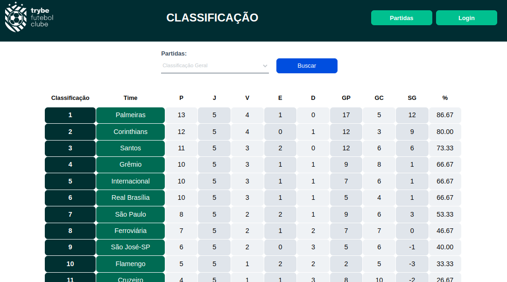

# Trybe Futebol Clube

## Sobre o Projeto
Aplicação desenvolvida para apresentar informações sobre partidas e classificações em campeonatos de futebol.

## Tecnologias e Ferramentas empregadas
Node.js;
TypeScript;
Express;
Sequelize;
Chai;
React.js;
Context API;
Mysql; e
Docker.

## Status do Projeto
Aplicação em funcionamento.

## Acesso à Aplicação
### Antes da instalação
Fazer o Clone do repositório.
### Instalação e Execução
A. Entrar no diretório app:

  $ cd app

B. Iniciada pelo Docker através do comando:
  
  $ docker compose up

C. Serão iniciados os três containers:
  1. container docker db, com o banco de dados em MySQL;
  2. container docker backend, com o backend em Node.js; e
  3. container docker frontend, com o frontend em Node.js;

D. Acessar através do navegador:
  
http://localhost:3000

## Contribuintes
|Nome|GitHub|
| -------- | -------- |
|Trybe|https://github.com/trybe-tech-ops|
|Moisés Fernandes|https://github.com/moisesfdasilva|

## Contato
[GitHub: Repositório-trybe-futebol-clube](https://github.com/moisesfdasilva/trybe-futebol-clube)
